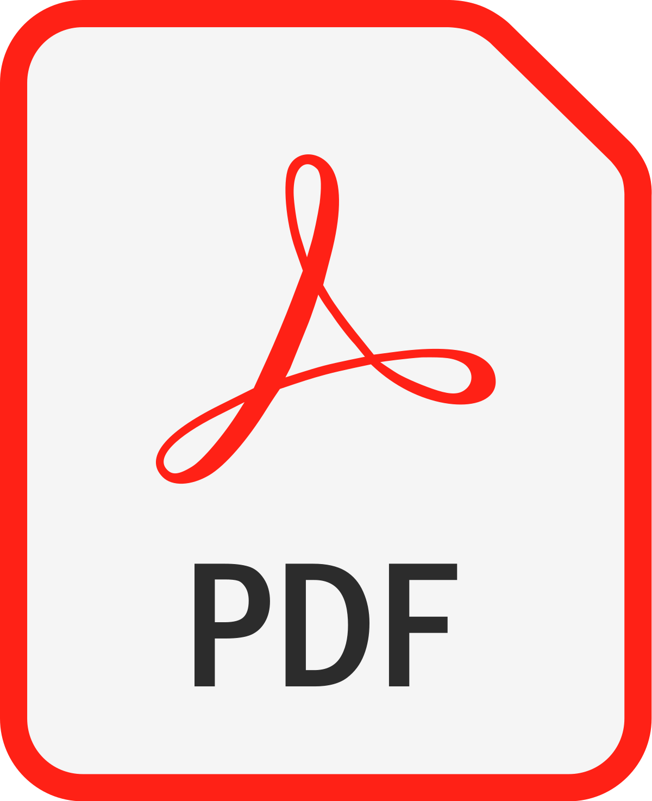

# WasteIncineratorService

## Intro
WasteIncineratorService is the final project assigned by Prof. [anatali](https://github.com/anatali) for the major course of Software Engineering. 
You can find the requirements of the application [here](resources/docs/requirements.pdf)

## QAK
The majority of the project has been modelled using QAK (Quasi Actor Kotlin), a DSL created at UNIBO using xText that compiles directly into kotlin code.
QAK allowed us to design the application with an higher level of abstraction, using concept as Actors,Requests,Dispatches and Events rather than Objects, Sockets and Network Protocols.
tou can find a description of QAK  [here](resources/docs/qak.pdf)

## Development process
We adopted a Scrub inspired development process, where the main assignement was divided in a series of sub-problems each faced during in a Sprint.
At the end of each Sprint we produced an executable version of the system covering some of the requirements.

### Sprints

<table>
    <tr>
        <th>
            <b>Sprint Name</b>
        </th>
        <th>
            <b>Description</b>
        </th>
        <th>
            <b>QAK</b>
        </th>
        <th>
            <b>UserDoc</tb>
        </th>
    </tr>
    <tr>
        <td>
            <a href="./WIS_Sprint0/">WIS_Sprint0</a>
        </td>
        <td>
            requirements and problem analysis
        </td>
        <td>
            <a href="./WIS_Sprint0/src/sprint0.qak">sprint0.qak</a>
        </td>
        <td>
             <a href="./WIS_Sprint0/userDocs/sprint0.md">sprint0.md</a> 
             <a href="./WIS_Sprint0/userDocs/sprint0.pdf" title="sprint0.pdf" download>sprint0.pdf</a>
        </td>
    </tr>
</table>

## Usage

## Credits
