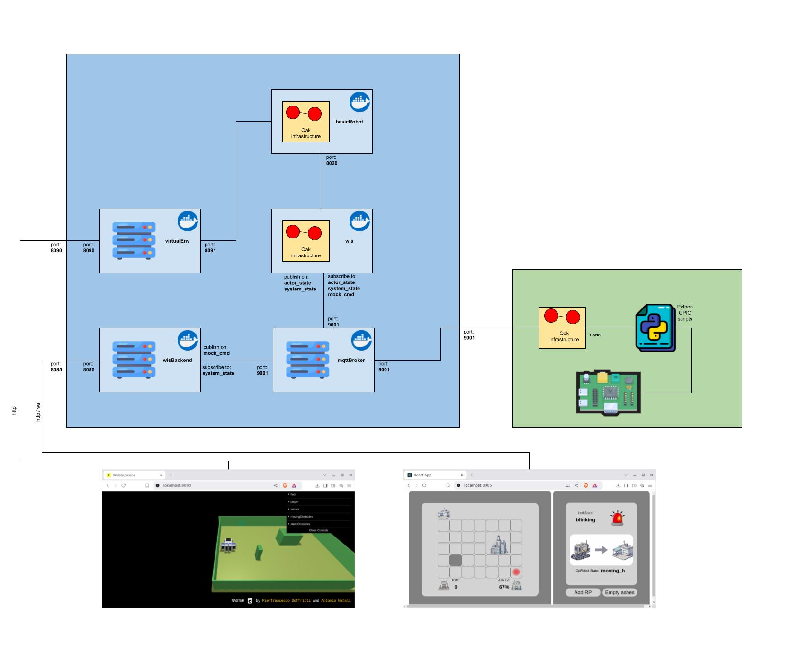

<link rel="stylesheet" type="text/css" href="resources/css/custom.css" />

# Waste Incinerator Service

## Sprint info

<table>
<tr><th>Sprint name</th><td>Sprint 3</td></tr>
<tr><th>Previous sprint</th><td><a href="/WIS_Sprint2">Sprint 2</a></td></tr>
<tr><th>QAK model</th><td><a href="../src/sprint3.qak">sprint3.qak</a></td></tr>
<tr><th>Developed by</th><td>Alessio Benenati<br/>Giulia Fattori</td></tr>
<tr><th>Repo Site</th><td><a href="https://github.com/b3nny01/WasteIncineratorService">WasteIncineratorService</td><tr>
</table>

## Sprint Starting Condition and Goals

In the previous sprint, we focused on the MonitoringDevice and how to connect its physical components to our system.<br/>
In this sprint, we aim to connect our fully working system to a web interface to show users all the steps taken by OpRobot and let them interact directly with it; on top of that, we will dockerize all of our sprints in different containers for easier activation.

## Requirements

In the previous sprint review, to test the virtual environment application more easily, the client asked to add two buttons to the user interface, one to increase the number of RP in WasteStorage, the other to free AshStorage.

## Problem Analysis

### MQTT

All the previous sprints used the qak function _updateResource_ to emit updates that are then read by the observers; this method introduces quite a strong coupling between the different components of the system.<br/>
Another possibility is using a publish/subscribe protocol, like **MQTT**, that introduces an intermediary between the communicating qak actors and grants a **higher degree of separation** throughout the entire system, as well as more robust communication. 

### Interface

Following the system requirements, a **ServiceStatusGui** is needed to display and update the status of two storages, the incinerator, and the OpRobot; on top of that, it must give the user the possibility to increase the number of RP in WasteStorage and empty completely the AshStorage.<br/>
Consequently, the Gui needs **both to receive and send information** from and to the qak system, which means they require a common communication protocol to exchange this data in real-time. The Gui also has to display all the required information on a **graphic interface**, using different intuitive icons.

## Project

### Project Architecture 
At the end of the sprint2 the system architecture was the following:
 


Based on the Problem Analysis carried out previously, we upgraded the executable version of the system covering the discussed features;<br/> we attach here a visual representation of the new system architecture:
 


As can be seen, the adoption of the MQTT protocol allowed a greater level of independence, in particular, the WIS does not need anymore to know the MonitoringDevice ip address, while the MonitoringDevice still needs the main host ip address to communicate with the MQTT broker, but it can be injected at runtime by the SystemConfigurator using the `monitoring_device.properties` file.

## Implementation

### Docker
To simplify the application deployment, we decided to **dockerize all the components of the system** but the MonitoringDevice, since it needs to run on an embedded device.<br/>
Here we attach the resulting deployment architecture:
 

The following schema instead shows the mock deployment architecture:
 


### MQTT Broker

A **MQTT Broker** is needed to implement the MQTT protocol. We decided to use a Mosquitto local broker, as it is easily integrated alongside our qak architecture; this broker is also used to implement communication between the ServiceStatusGui and the qak system, more details will be given in the next section.<br/>
The actors that need to send or receive messages connect to the broker and then either **subscribe to or publish updates on specific topics**:</br>
* **actor_state**: topic used by the actors to publish updates about their own status.
* **system_state**: topic used by WIS to expose the real-time state of the whole system.
* **mock_cmd**: topic used by Backend to send the command (increase RP or empty AshStorage) when a button is pressed.

### ServiceStatusGui

We decided to split our Gui into two projects:<br/>
* **Backend**: it manages all communication between the Gui and the WIS System, using the MQTT protocol.
* **Frontend**: React Application showing the console. It communicates with Backend via WebSocket.

## Test Plan

For this sprint, we switched to a new QAK tester project, TEST_Sprint3, instead of using the JUnit library. This change simplifies communication with all system components.  

**Test Project**: [wis_tester](../../TEST_Sprint3/src/wis_tester.qak)

<table>
<tr>
  <th><b>Test Name</b></th>
  <th><b>Initial Condition</b></th>
  <th><b>Expected Behavior</b></th>
</tr>
<tr>
  <td><b>test_check_n1</b></td>
  <td>WasteStorage contains 5 RP, AshStorge is empty, nobody empties AshStorage, Incinerator is inactive</td>
  <td>Once the OpRobot check the system state for the first time, the the WasteStorage contains 5RP, the Incinerator is active, and the AshStorage is empty</td>
</tr>
<tr>
  <td><b>test_check_n2</b></td>
  <td>test_check_n1 is ok</td>
  <td>Once the OpRobot check the system state for the second time, the the WasteStorage contains 4RP, the Incinerator is active, and the AshStorage is 1/3 full</td>
</tr>
<tr>
  <td><b>test_check_n3</b></td>
  <td>test_check_n2 is ok</td>
  <td>Once the OpRobot check the system state for the second time, the the WasteStorage contains 3RP, the Incinerator is active, and the AshStorage is 2/3 full</td>
</tr>
<tr>
  <td><b>test_check_n4</b></td>
  <td>test_check_n3 is ok</td>
  <td>Once the OpRobot check the system state for the second time, the the WasteStorage contains 3RP, the Incinerator is active, and the AshStorage is full</td>
</tr>
</table>

## Usage

### System Activation
Then, you have to activate the monitoring device, to do so connect to your Raspberry via `ssh` then move inside the `monitoring_device-1.0/bin` folder, and run
```
./monitoring_device
```

Lastly, you have to activate the WIS system by opening a third terminal inside the `WIS_Sprint3` folder and running

```
docker compose up
```
**N.B.** Type `docker compose -f docker-compose-mock.yaml up` if you want to launch the mock version of the application, or `docker compose -f docker-compose-test.yaml up | grep tester-1` if you want to launch the test configured system


### Monitoring Device
Firstly, you will need:
* a raspberry (we used a raspberry PI 3+)
* a led
* a sonar (HCSR04)
* a 220ohm resistor
* a breadboard

You will have to assemble those elements following this wiring scheme:


Then you will have to deploy the Monitoring Device control software, to do so, open a terminal inside the `MD_Sprint3` folder run

```
gradlew build
```

After that, copy the `MD_Sprint3/build/distributions/monitoring_device-1.0.zip` folder inside the Raspberry (for instance using `scp`) and unzip it
