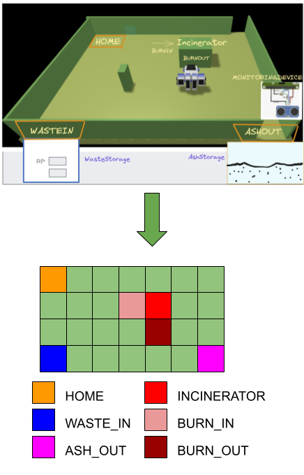
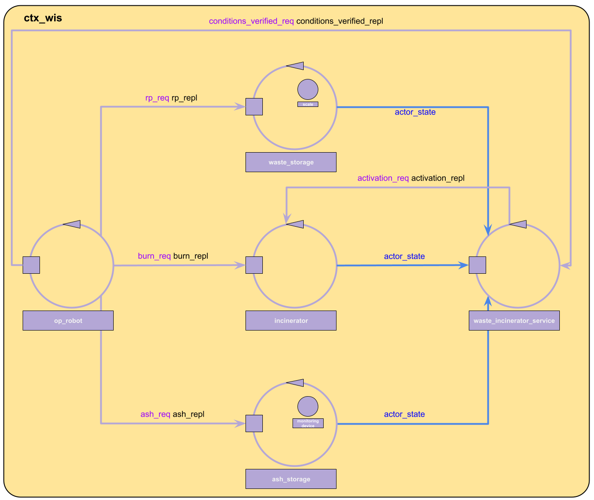

# Waste Incinerator Service

## Requirements Analysis

### Structure
analyzing the natural language requirements text we found out the following entities that should be somehow modelled:
* ServiceArea
  * Home
  * BurnIn port
  * BurnOut port
  * WasteIn
  * AshOut
* OpRobot
* DDRRobot
* WIS
* Incinerator
* WasteStorage
  * Scale
  * RP
  * WRP
* AshStorage
  * MonitoringDevice
  * Sonar
  * Led

### Interaction and Behaviour
By requirements we inferred the following informations that need to be modelled:

<table>
  <tr>
    <td><b>Information</b></td>
    <td><b>Source</b></td>
    <td><b>Destination</b>
    </td><td><b>Description</b></td>
  </tr>
  <tr>
    <td>activationCommand</td>
    <td>unspecified</td>
    <td>Incinerator</td>
    <td></td>
  </tr>
  <tr>
    <td>isBurning</td>
    <td>Incinerator</td>
    <td>unspecfied</td>
    <td></td>
  </tr>
    <tr>
    <td>ashLevel</td>
    <td>Sonar</td>
    <td>unspecified</td>
    <td></td>
  </tr>
  <tr>
    <td>loadRP</td>
    <td>WasteStorage</td>
    <td>OpRobot</td>
    <td></td>
  </tr>
  <tr>
    <td>unloadRp</td>
    <td>OpRobot</td>
    <td>Incinerator</td>
    <td></td>
  </tr>
  <tr>
    <td>loadAsh</td>
    <td>Incinerator</td>
    <td>OpRobot</td>
    <td></td>
  </tr>
  <tr>
    <td>unloadAsh</td>
    <td>OpRobot</td>
    <td>AshStorage</td>
    <td></td>
  </tr>
</table>

> [!NOTE]
> we merged Interactions and Behaviour sections because at this stage of the project for the majority of this informations we don't know yet if they will be modelled as POJOs' methods or messages between actors

#### Service Area Model
the **ServiceArea** is modelled as an Euclidean space delimited by its edges(similar to what has been done in the [BoundaryWalk](resources/slides/BoundaryWalkProjectDoc.pdf) and [RobotCleaner](resources/slides/RobotCleanerProjectDoc.pdf) projects):

* the **perimeter edge** has length ```lf+ld+lr+lu```
* being the ServiceArea rectangular we have ```lf=lr && ld==lu```
* we define ```DR=2R``` being ```R``` the radius of the DDRRobot    circumscribable circle


Given this model we have that **Home**, **BurnIn**, **BurnOut**,**WasteIn**, **AshOut** are all modelled as cells in the serviceArea:



#### DDRRobot model

The **OpRobot**, defined in the requirements as the robot controlled by the WIS, makes use of a DDRRobot (and its control software) given by the customer, we link the [detailed definition of DDRRobot](resources/slides/BasicRobot24ProjectDoc.pdf) and its [qak control software](resources/projects/basicrobot.qak).


### WIS, WasteStorage, Incinerator and AshStorage models
**WasteStorage**, **Incinerator** and **AshStorage** need to exchange messages by requirements so they are modelled as Actors.
**Scale** can be modelled both as an actor or a POJO inside WasteStorage, for now we will represent it as a Pojo and **demand the discussion to another moment**.
The same can be said for **MonitoringDevice**, **Sonar** and **Led**, that will be for now modelled as POJOs inside AshStorage.
In the first prototype of the model we will introduce the **WIS** actor (waste_incinerator_service) as the 'brain' of the application, however by requirements there are **no specification** about where to inject the businsess logic (the OpRobot for example could also be an eligible option), so we **demand the discussion to the Problem Analysis**.
The following diagram illustrate the structure of what has been produced basing on requirements:




<!--
Priority
core buisness = Incinerator => probably i'll have to analyze the MonitoringDevice before the raspberry and the Scale
-->

<!--
TODO
## Problem Analysis
### Entities Models

* ServiceArea -> other serviceAreas models
* WIS         -> service (sends/recives messages)
* OpRobot     -> service (given as service)
* DDRRobot    -> service (sends/recives messages)
* Home        -> colections of cells inside the serviceArea
* Incinerator -> actor (sends/receives messages) || pojo
  * BurnIn port
  * BurnOut port
* WasteIn      -> collections of cells || coordinates
* WasteStorage -> context?
  * Scale      -> actor (if sends/recives messages) || pojo (if Scaleinfo is retrieved using a method)
* RP           -> pojo
  * WRP        -> pojo attribute || config param of Scale actor, so that Scale sends the number of RPs, not the weights
* AshOut       -> collections of cells || coordinates
* AshStorage   -> context? (outside service area?)
* MonitoringDevice: -> actor? || context?
  * Sonar      -> actor (sends/receives messages) || pojo
  * Led        -> actor (receives messages) || pojo (is quite simple)
-->