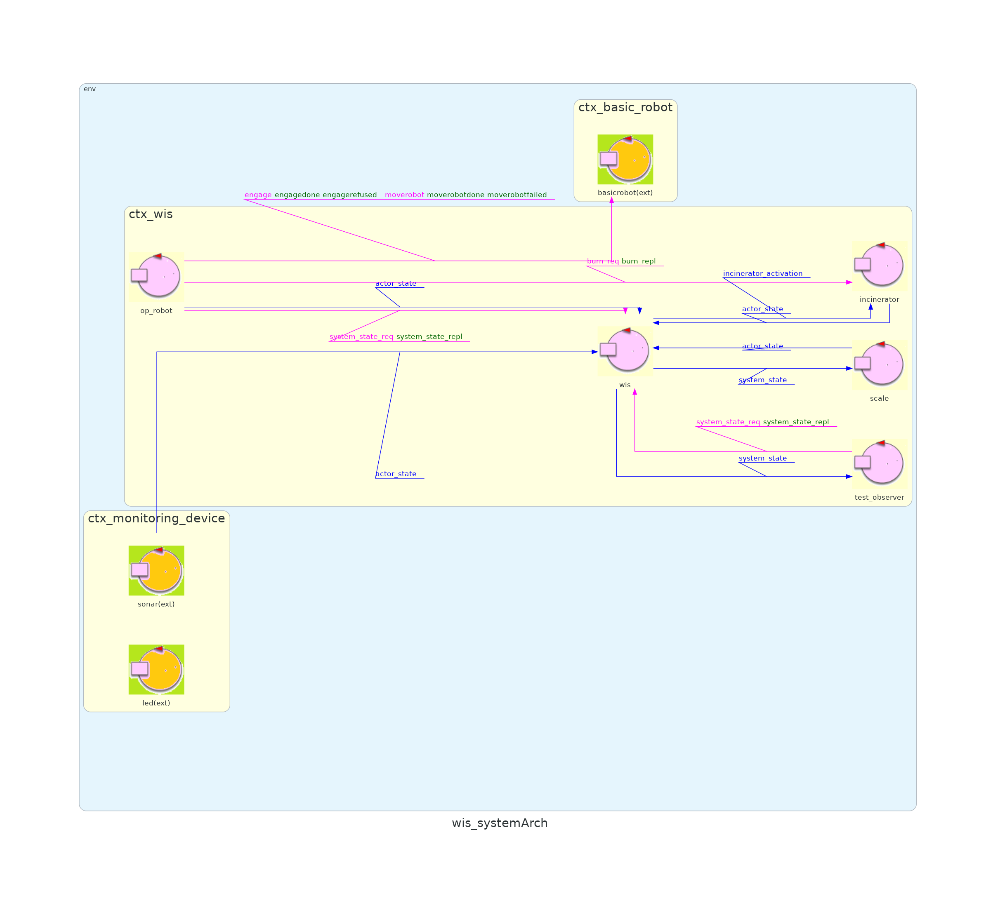
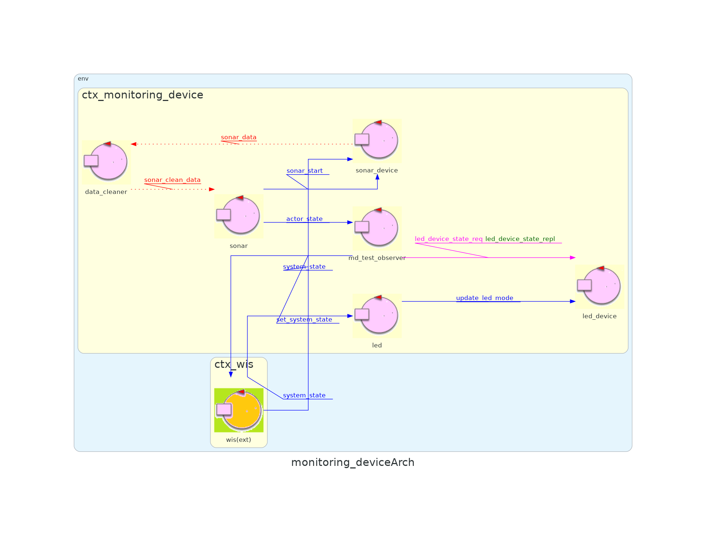

<link rel="stylesheet" type="text/css" href="resources/css/custom.css" />

# Waste Incinerator Service

## Sprint info 

<table>
<tr><th>Sprint name</th><td>Sprint 3</td></tr>
<tr><th>Previous sprint</th><td><a href="/WIS_Sprint2">Sprint 2</a></td></tr>
<tr><th>Next sprint</th><td></td></tr>
<tr><th>QAK model</th><td><a href="../src/sprint3.qak">sprint3.qak</a></td></tr>
<tr><th>Developed by</th><td>Alessio Benenati<br/>Giulia Fattori</td></tr>
<tr><th>Repo Site</th><td><a href="https://github.com/b3nny01/WasteIncineratorService">WasteIncineratorService</td><tr>
</table>

## Sprint Starting Condition and Goals

In the previous sprint, we focused on studying the requirements related to the application logic of OpRobot and WIS.**In this sprint, the focus is on the MonitoringDevice**, specifically aiming to **connect the virtual system** produced in sprint 1 **to a real MonitoringDevice** deployed on a physical Raspberry Pi.

## Problem Analysis

### MonitoringDevice subcomponents

In the previous sprints, we hid the complexity of the monitoring device in a single mock actor without worrying about its subcomponents (LED and Sonar).  
A more in-depth study of the component's application logic reveals two possible approaches:  
- Developing a single MonitoringDevice actor responsible for both managing the LED and emitting data from the Sonar.  
- Breaking down the MonitoringDevice into two distinct actors, the LED and the Sonar.  

The second solution allows for greater decoupling between the two components, especially considering their different nature (the Sonar is a "producer" of information while the LED acts as a "consumer").  
For this reason, it is recommended to **decompose the MonitoringDevice into its two subcomponents (LED and Sonar) and implement them as two independent actors in the same context**.

### Analysis Architecture
Below, we present a comparison between the system architecture derived from the problem analysis in sprint 1 and the one resulting from sprint 2.

**Sprint 1 Architecture:**
<br/>

<br/>

**Sprint 2 Architecture:**
<br/>

<br/>

## Project

### Project Architecture

Based on the Problem Analysis carried out previously, we implemented an executable version of the system covering the discussed features; we attach here a visual representation of the system architecture:


## Implementation

### Sonar and Led abstraction
During the implementation, we encountered the **high sensitivity of the Sonar**, which often produces "noisy" data. For this reason, **it became necessary to introduce a "Filtering Pipeline"** to eliminate spurious data.  

Specifically, this pipeline is composed of three actors:
- **SonarDevice**, which handles the actual reading of all data from the physical sonar.
- **DataCleaner**, which monitors the SonarDevice and filters the relevant results for the problem, aiming to minimize the effect of measurement errors.
- **Sonar**, which serves as the "interface" towards the WIS.

In order to decouple the py we decided to split the Led actor into:
- **LedDevice**, which handles the communication with the physical led
- **Led**, which incorporates the Led business logic, deciding when to turn on and off the led

### System Configurability
During the implementation we faced the problem of the **lack of System Configurability**, so we decided to create a support singleton object **the SystemConfigurator** who is in charge of **loading the main properties of the system from a file during actors'initialization**.
 
**MonitoringDevice context details:**



## Test Plan

**Test Class**: [WISTest](../src/main/java/test/WISTest.java)

<table>
<tr>
  <th><b>Test Name</b></th>
  <th><b>Initial Condition</b></th>
  <th><b>Expected Behavior</b></th>
</tr>
<tr>
  <td><b>test00_IncinineratorActivation</b></td>
  <td>WasteStorage contains 4 RP, AshStorge is empty, nobody empties AshStorage, Incinerator is inactive</td>
  <td>Once the system is initialized, the Incinerator is active</td>
</tr>
<tr> 
  <td><b>test01_Ok5RP</b></td>
  <td>WasteStorage contains 5 RP, AshStorge is empty and can contain the ashes of 3 RPs, nobody empties AshStorage</td>
  <td>After some time WasteStorage contains 2 RP and AshStorage is full</td>
</tr>
</table>

**Test Class**: [MDTest](/MD_Sprint2/src/main/java/test/MDTest.java)
<table>
<tr>
  <th><b>Test Name</b></th>
  <th><b>Initial Condition</b></th>
  <th><b>Expected Behavior</b></th>
</tr>
<tr>
  <td><b>test00_SonarUnloadAsh</b></td>
  <td>AshStorge is empty, nobody empties AshStorage, Sonar is monitoring AshStorage, OpRobot is unloading ash in the AshStorage</td>
  <td>Once OpRobot is done unloading the ash, Sonar detects the ash level change</td>
</tr>
<tr> 
  <td><b>test01_LedBurning</b></td>
  <td>Incinerator is inactive, Led is off</td>
  <td>When the Incinerator is activated, Led starts blinking. When the Incinerator is stopped, Led turns back off</td>
</tr>
 <tr>
  <td><b>test02_LedEmptyWasteStorage</b></td>
  <td>WasteStorage contains 1 RP, AshStorage is empty, Incinerator is inactive, Led is off</td>
  <td>When WasteStorage gets emptied, Led turns on. When WasteStorage gets filled with a new RP, Led turns back off</td>
</tr>
<tr> 
  <td><b>test03_LedFullAshStorage</b></td>
  <td>AshStorge is empty, WasteStorage is not empty, Incinerator is inactive, Led is off</td>
  <td>When AshStorage fills up, Led turns on. When AshStorage gets emptied, Led turns back off</td>
</tr>
</table>

### Usage

#### Basic Robot Activation
To test the system you will have to activate the Virtual Environment first.
To do so, open a terminal in the `unibo.basicrobot24` folder and type
```
docker compose -f virtualRobot23.yaml up
```
**N.B.** If you have an older version of docker, you may have to type `docker-compose` instead of `docker compose`

Next activate the BasicRobot.
It will act as a mediator between the VirtualRobot and the WasteIncineratorService application.
To do so, open another terminal inside the `unibo.basicrobot24` folder and type 

```
gradlew run
```

#### Monitoring Device
After that, you will need:
* a raspberry (we used a raspberry PI 3+)
* a led
* a sonar (HCSR04)
* a 220ohm resistor
* a breadboard

You will have to assemble those elements following this wiring scheme:


Then you will have to deploy the Monitoring Device control software, to do so, open a terminal inside the `MD_Sprint2` folder run:

```
gradlew build
```

After that, copy the `MD_Sprint2/build/distributions/monitoring_device-1.0.zip` folder inside the raspberry (for instance using `scp`) and unzip it

#### System activation
Firstly you have to activate the monitoring device, to do so connect to your raspberry via `ssh`, then move inside the `monitoring_device-1.0/bin` folder and run
```
./monitoring_device
```

Lastly, you have to activate the WIS system by opening a third terminal inside the `WIS_Sprint1` folder and running

```
gradlew run
```
**N.B.** Type `gradlew test` if you want to launch JUnit tests instead of activating the system demo.

## Future Sprints
In the next sprint, we will focus on the GUI.<br/>
Our goal is to enable the possibility to connect to a web interface and check the state of the system. 
