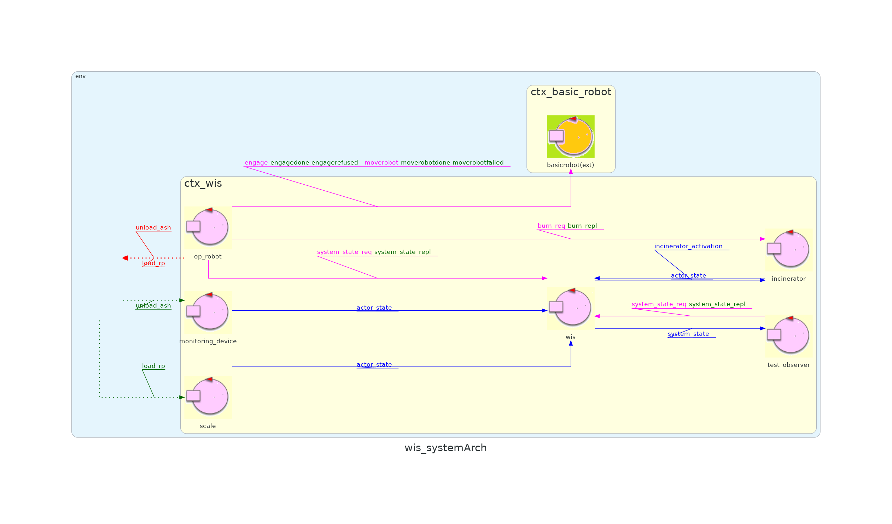

<link rel="stylesheet" type="text/css" href="resources/css/custom.css" />

# Waste Incinerator Service

## Sprint info

<table>
<tr><th>Sprint name</th><td>Sprint 3</td></tr>
<tr><th>Previous sprint</th><td><a href="/WIS_Sprint2">Sprint 0</a></td></tr>
<tr><th>Next sprint</th><td><a href="">Sprint 1</a></td></tr>
<tr><th>QAK model</th><td><a href="../src/sprint3.qak">sprint1.qak</a></td></tr>
<tr><th>Developed by</th><td>Alessio Benenati<br/>Giulia Fattori</td></tr>
<tr><th>Repo Site</th><td><a href="https://github.com/b3nny01/WasteIncineratorService">WasteIncineratorService</td><tr>
</table>

## Sprint Starting Condition and Goals

In the previous sprint, we focused on the MonitoringDevice and how to connect its physical components to our system. In this sprint, we aim to connect our fully working system to a web interface to show users all the steps taken by OpRobot and let them interact directly with it; on top of that, we will dockerize all of our sprints in different containers for easier activation.

## Problem Analysis

### MQTT

All the previous sprints used the qak function _updateResource_ to emit updates that are then read by the observers; this method introduces quite a strong coupling between the different components of the system.
Another possibility is using a publish/subscribe protocol, like **MQTT**, that introduces an intermediary between the communicating qak actors and grants a **higher degree of separation** throughout the entire system, as well as more robust communication. 

### Interface

Following the system requirements, a **ServiceStatusGui** is needed to display and update the status of two storages, the incinerator, and the OpRobot; on top of that, it must give the user the possibility to increase the number of RP in WasteStorage and empty completely the AshStorage. 
Consequently, the Gui needs **both to receive and send information** from and to the qak system, which means they require a common communication protocol to exchange this data in real-time. The Gui also has to display all the required information on a **graphic interface**, using different intuitive icons.

## Project

### Project Architecture

Based on the Problem Analysis carried out previously, we implemented an executable version of the system covering the discussed features; we attach here a visual representation of the system architecture:



## Implementation

### MQTT Broker

A **MQTT Broker** is needed to implement the MQTT protocol. We decided to use a Mosquitto Broker, as it is easily integrated alongside our qak architecture; this broker is also used to implement communication between the ServiceStatusGui and the qak system, more details will be given in the next section.
The actors that need to send or receive messages connect to the broker and then either **subscribe to or publish updates on a specific topic**.

### ServiceStatusGui

We decided to split our Gui into two sections:
-**Backend**: it manages all communication between the Gui and the WIS System, using the same MQTT Broker used by WIS and a specific topic
-**Frontend**: 

## Test Plan

**Test Class**: [WISTest](../src/main/java/test/WISTest.java)

<table>
<tr>
  <th><b>Test Name</b></th>
  <th><b>Initial Condition</b></th>
  <th><b>Expected Behavior</b></th>
</tr>
<tr>
  <td><b>testIncinineratorActivation</b></td>
  <td>WasteStorage contains 4 RP, AshStorge is empty, nobody empties AshStorage, Incinerator is inactive</td>
  <td>Once the system is initialized, Incinerator is active</td>
</tr>
<tr> 
  <td><b>testOk4Rp</b></td>
  <td>WasteStorage contains 4 RP, AshStorge is empty and can contain the ashes of 3 RPs, nobody empties AshStorage</td>
  <td>After some time WasteStorage contains 1 RP and AshStorage is full</td>
</tr>
</table>

### Usage
To test the system you will have to activate the Virtual Environment first.
To do so, open a terminal in the `unibo.basicrobot24` folder and type
```
docker compose -f virtualRobot23.yaml up
```
**N.B.** If you have an older version of docker, you may have to type `docker-compose` instead of `docker compose`

After that, you will have to activate the BasicRobot, which will act as a mediator between the VirtualRobot and the WasteIncineratorService application.
To do so open another terminal inside the `unibo.basicrobot24` folder and type 

```
gradlew run
```

Lastly, you have to activate the WIS system by opening a third terminal inside the `WIS_Sprint1` folder and running

```
gradlew run
```
**N.B.** Type `gradlew test` if you want to launch JUnit tests instead of activating the system demo.

## Future Sprints
In the next sprint, we will focus on the MonitoringDevice's behavior.<br/>
Our goal is to connect the actual prototype of the system to a real monitoring device deployed on a real raspberry. 
